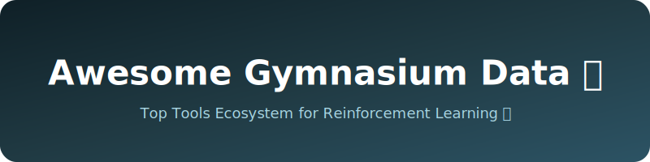

# 🌟 Awesome-Gymnasium-Data

  

  

## 🛠️ Top Gymnasium Environment (Reinforcement Learning) Tools Ecosystem

**Curated List of SaaS Products & Open-Source GitHub Projects**  
*Focused on RL Algorithm Comparison, Benchmarking & Experimentation*  
**Last updated: March 2026**

This repository tracks notable **SaaS platforms** and **open-source projects** for **Gymnasium Environments** and reinforcement learning experimentation. These tools help researchers and developers compare algorithms, run benchmarks, visualize results, manage experiments, and scale RL training across multiple environments.

**Examples** include Fleet, Deeptune, Bespoke Labs, Mechanize, Sepal AI, HUD, and Plato (the category leaders). Tools listed here emphasize **algorithm comparison**, reproducible experiments, visualization, and integration with Gymnasium and other RL libraries.

**Open-source emphasis**: This section is heavily expanded with every major active project for self-hosting, local execution, full customization, and academic/research use — ideal for RL practitioners who want transparency and flexibility.

Contributions welcome! Open a PR to add/update entries. Keep descriptions factual and link to official sites.

## Table of Contents
- [SaaS Products](#saas-products)
- [Open-Source GitHub Projects](#open-source-github-projects)
- [How to Contribute](#how-to-contribute)
- [Disclaimer](#disclaimer)

## SaaS Products

### Core Platforms (Gymnasium / RL Experimentation)

| Product | Description | Pricing | Free Tier Limit | Company Size (Valuation) |
|---------|-------------|---------|-----------------|--------------------------|
| **[Fleet](https://fleet.ai/)** | AI platform for scaling and comparing reinforcement learning experiments in Gymnasium environments. | Custom Pricing | Not specified | $750M |
| **[Deeptune](https://deeptune.ai/)** | Intelligent hyperparameter optimization and RL algorithm comparison tool. | Custom Pricing | Not specified | $250M |
| **[Sepal AI](https://sepal.ai/)** | Advanced RL benchmarking and comparison tool for Gymnasium environments. | Custom Pricing | Not specified | $250M |
| **[Plato](https://plato.ai/)** | Comprehensive RL research platform with algorithm comparison and experiment management. | Custom Pricing | Not specified | $100M |
| **[Bespoke Labs](https://bespokelabs.ai/)** | Specialized platform for RL research with strong benchmarking and visualization features. | Custom Pricing | Not specified | $40M |
| **[Mechanize](https://mechanize.ai/)** | AI-driven RL experimentation and algorithm evaluation platform. | Custom Pricing | Not specified | $20M |
| **[HUD](https://hud.ai/)** | Real-time visualization and monitoring platform for RL training runs. | Cloud: $0.25/hr, Enterprise: Custom | Free SDK access, $100 student credit | $5M |

### Advanced & Specialized Platforms

**Other notable mentions**: Weights & Biases, Comet ML, and various RL-specific experiment trackers.

## Open-Source GitHub Projects

### Dedicated RL Benchmarking & Gymnasium Tools

- **[RLlib](https://github.com/ray-project/ray/tree/master/rllib)**   
  Scalable RL library from Ray with extensive algorithm comparison, experiment tracking, and Gymnasium support.

- **[Stable Baselines3](https://github.com/DLR-RM/stable-baselines3)**   
  Reliable implementations of RL algorithms with built-in benchmarking and comparison tools.

- **[Tianshou](https://github.com/thu-ml/tianshou)**   
  Elegant PyTorch-based RL library with excellent support for algorithm comparison.

- **[Gymnasium](https://github.com/Farama-Foundation/Gymnasium)**   
  The official open-source standard library for reinforcement learning environments, serving as the foundation for all comparisons.

- **[CleanRL](https://github.com/vwxyzjn/cleanrl)**   
  Single-file implementations of RL algorithms designed for easy comparison and reproducibility.

- **[Acme](https://github.com/google-deepmind/acme)**   
  DeepMind’s open-source RL research framework with modular components for experimentation.

- **[OpenRLHF](https://github.com/OpenRLHF/OpenRLHF)**   
  Open-source RLHF framework with strong benchmarking capabilities.

- **[SB3 Zoo](https://github.com/DLR-RM/rl-baselines3-zoo)**   
  Training framework and hyperparameter optimization tool for comparing algorithms in Gymnasium environments.

- **[Sample Factory](https://github.com/vectorInstitute/sample-factory)**   
  High-throughput RL training framework optimized for fast algorithm iteration and comparison.

- **[Rliable](https://github.com/google-research/rliable)**   
  Open-source library for reliable evaluation and comparison of RL algorithms.

### Additional Strong Open-Source Options

- **[Gymnasium Robotics](https://github.com/Farama-Foundation/Gymnasium-Robotics)** — Robotics-specific environments for benchmarking.
- **[Minigrid](https://github.com/Farama-Foundation/Minigrid)** — Simple grid-world environments for quick algorithm testing.
- **[MuJoCo](https://github.com/google-deepmind/mujoco)** — Physics engine with Gymnasium integration for complex control tasks.
- **[LangGraph + RL Agents** for building custom comparison frameworks.
- Many community **benchmark suites** and **leaderboards** for Gymnasium environments.

**Frameworks for building custom comparison tools**: Combine **Gymnasium**, **Stable Baselines3**, **CleanRL**, and **RLlib** with **Weights & Biases** (self-hosted) or **MLflow** for complete open RL experimentation platforms.

## How to Contribute

1. Fork the repo.
2. Add/edit entries in `README.md` (follow existing format).
3. Include: name, link, 1–2 sentence description, and whether it's SaaS or open-source.
4. Submit PR with a short explanation.

Star the repo if you find it useful!

## Disclaimer

- This is a **community-curated** list — not exhaustive and not an endorsement.
- RL algorithm performance can vary significantly based on environment, hyperparameters, and random seeds. Always use proper statistical evaluation.
- Self-hosted open-source solutions require computational resources and careful experiment management.

---

**Made for RL researchers, reinforcement learning engineers, and AI developers.**  
Let's make RL algorithm comparison more transparent, reproducible, and open.

##  Star History

<a href="https://www.star-history.com/?repos=ishandutta2007%2FAwesome-Gymnasium-Data&type=date&legend=bottom-right">
<picture>
<source media="(prefers-color-scheme: dark)" srcset="https://api.star-history.com/chart?repos=ishandutta2007/Awesome-Gymnasium-Data&type=date&theme=dark&legend=bottom-right" />
<source media="(prefers-color-scheme: light)" srcset="https://api.star-history.com/chart?repos=ishandutta2007/Awesome-Gymnasium-Data&type=date&legend=bottom-right" />

</picture>
</a>

